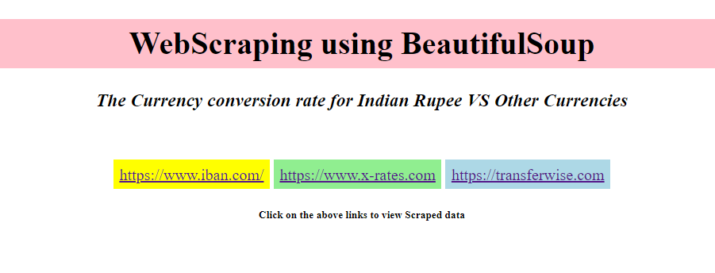

# Web-Scraping
The Currency conversion rate for Indian Rupee VS Other Currencies.
### link for the website - http://currency--conversion.herokuapp.com/

### The objective of this project is to scrap the foreign exchanges rates from different websites (I have used three websites).

Everytime we click on the links, the scraped data will be shown in the form of table and updated data(on the basis of date and time we choose the website) will gets added to their respective excel sheets.
